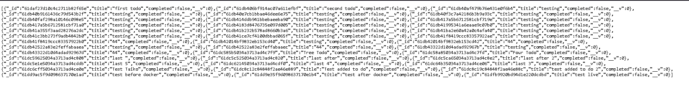

# To-Do Api

> This is a Nodejs and Express based server application about Todo list.  
# How To Use It
> This project purpose exercise 
> I used to  nodejs,express

# Screenshot

# Getting Started

To get a local copy up and running follow these simple steps.

- You can clone this repo by typing `git clone https://github.com/AtillaTahak/Assessment.git` on your terminal.

- Type `cd Assessment` to access the project on the terminal.

- Type `cd Server` to access the project on the terminal.
  
- Run `npm install` from your editor's terminal.

- Run `npm run build` from your editor's terminal.

- Run `npm run start` from your editor's terminal to view the project in your browser.

- Run `npm test` Test for Acceptance test

- Run `test:provider` Test for Contract test

# This project was built with:

HTML5

CSS3

React

Redux

Nodejs

Express

# Version Control System

GIT

# 👤 Authors

👤 **ATİLLA TAHA KÖRDÜĞÜM**

- GitHub: [@AtillaTahak](https://github.com/AtillaTahak)
- Twitter: [@AtillaTahaa](https://twitter.com/AtillaTahaa)
- LinkedIn: [LinkedIn](https://www.linkedin.com/in/atilla-taha-kördüğüm-a93702186/)
- Blog: [Blog](atillataha.blogspot.com)
- Youtube: [YouTube](https://www.youtube.com/channel/UCmoD0x4Z9vdG2PCsI5p8FYg)

# 🤝 Contributing

Contributions, issues, and feature requests are welcome!

Feel free to check the

# Show your support

Give a ⭐️ if you like this project!

# Acknowledgement
- Hat tip to anyone whose code was a source of inspiration.
- A big thanks to [@microverseinc](https://github.com/microverseinc) for providing the involvement API.

# 📝 License

This project is [MIT](./MIT.md) licensed.
